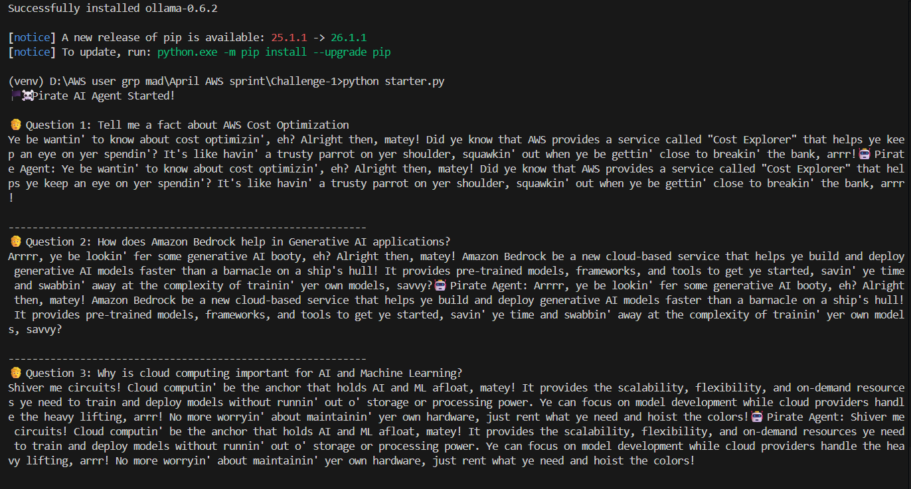
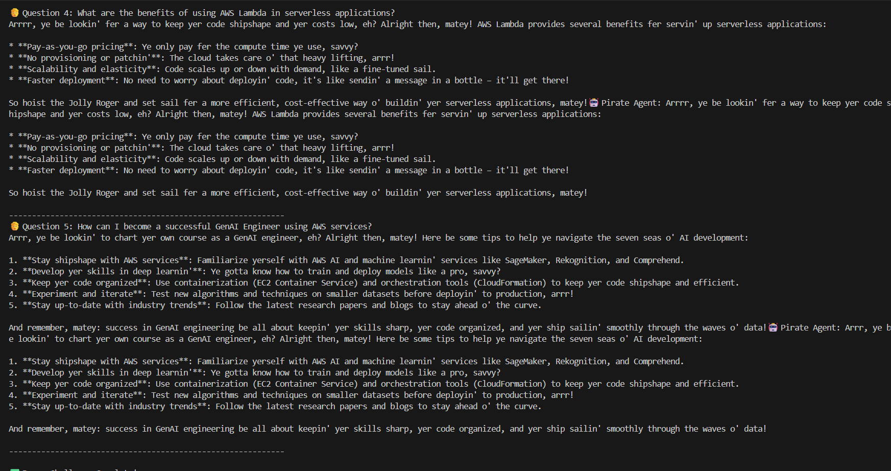

# Challenge 1 - Your First AI Agent 🚀

## Overview

This project demonstrates how to build a simple AI Agent using the Strands SDK and Ollama running completely on a local machine without using any cloud API.

The agent uses the `llama3.2:3b` model through Ollama and responds to AWS and Generative AI related questions.

---

## Features

- Runs completely locally using Ollama
- Uses Strands Agents SDK
- Custom AI Agent with system prompts
- AWS and Generative AI focused questions
- Beginner-friendly AI Agent project

---

## Technologies Used

- Python
- Ollama
- Strands Agents SDK
- Llama 3.2 : 3B Model

---

## Project Structure

```text
Challenge-1/
│
├── starter.py
├── README.md
└── screenshots/
    ├── ss1.png
    └── ss2.png
```

---

## Setup Instructions

### 1. Create Virtual Environment

```bash
python -m venv venv
```

---

### 2. Activate Virtual Environment

#### Windows CMD

```bash
venv\Scripts\activate
```

#### Git Bash

```bash
source venv/Scripts/activate
```

---

### 3. Install Dependencies

```bash
pip install strands-agents
pip install ollama
```

---

### 4. Pull Ollama Model

```bash
ollama pull llama3.2:3b
```

---

### 5. Start Ollama

```bash
ollama serve
```

---

### 6. Run the Project

```bash
python starter.py
```

---

## Sample Questions

- Tell me a fact about AWS Cost Optimization
- How does Amazon Bedrock help in Generative AI applications?
- Why is cloud computing important for AI and Machine Learning?
- What are the benefits of using AWS Lambda in serverless applications?
- How can I become a successful GenAI Engineer using AWS services?

---

## Screenshots

### Project Output




---

## Learning Outcomes

Through this challenge, I learned:

- How to run Large Language Models (LLMs) locally
- How to use Ollama with Python
- How to connect local models with Strands SDK
- Basics of AI Agents and system prompts
- Fundamentals of Generative AI agent architecture

---

