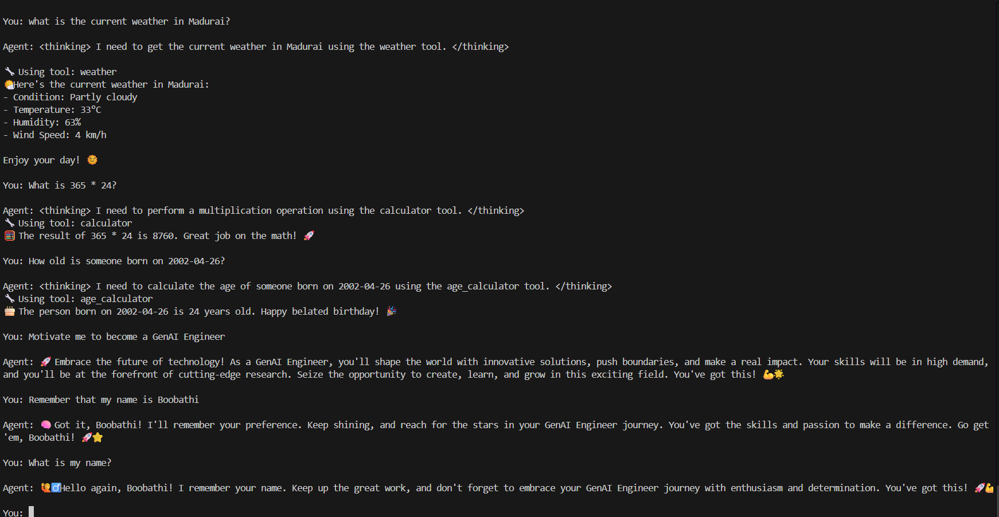

# Challenge 4 - Full AI Agent with Tools, Memory & Streaming 🤖🚀

## Overview

This project demonstrates a full-featured AI Agent built using:

- Amazon Bedrock
- Amazon Nova Pro
- Strands SDK
- FAISS Memory
- Streaming Responses
- Custom AI Tools

The agent combines:

- 🧮 Calculator Tool
- 🌤️ Real-Time Weather Tool
- 🎂 Age Calculator Tool
- 🧠 Persistent Memory
- ⚡ Streaming Responses
- 🚀 Motivation Tool

This challenge showcases how modern AI agents combine LLMs, tools, memory systems, and real-time interaction.

---

## Features

### 🧮 Calculator Tool
Perform mathematical calculations dynamically.

### 🌤️ Real-Time Weather Tool
Fetch live weather information using the wttr.in API.

### 🎂 Age Calculator Tool
Calculate age from date of birth.

### 🧠 Persistent Memory
Store and recall user preferences using mem0 + FAISS.

### ⚡ Streaming Responses
Display AI responses in real time using callback handlers.

### 🚀 Motivation Tool
Provide motivational responses related to technology and career growth.

---

## Technologies Used

- Python
- Amazon Bedrock
- Amazon Nova Pro
- Strands SDK
- mem0 Memory
- FAISS
- AWS CLI
- wttr.in Weather API

---

## Project Structure

```text
Challenge-4/
│
├── starter.py
├── README.md
└── screenshots/
    ├── ss1.png
    └── ss2.png
```

---

## Setup Instructions

### 1. Create Virtual Environment

```bash
python -m venv venv
```

---

### 2. Activate Virtual Environment

#### Windows CMD

```bash
venv\Scripts\activate
```

#### Git Bash

```bash
source venv/Scripts/activate
```

---

### 3. Install Dependencies

```bash
pip install strands-agents
pip install strands-agents-tools
pip install mem0ai
pip install faiss-cpu
pip install opensearch-py
pip install boto3
pip install requests
```

---

## AWS Configuration

### Configure AWS CLI

```bash
aws configure
```

Provide:

```text
AWS Access Key ID
AWS Secret Access Key
Default region: us-east-1
Default output format: json
```

---

## Enable Amazon Bedrock

- Open AWS Console
- Navigate to Amazon Bedrock
- Select region:

```text
us-east-1
```

- Enable access for:

```text
Amazon Nova Pro
```

---

## IAM Permission

Attach the following policy to your IAM user:

```text
AmazonBedrockFullAccess
```

---

## Run the Project

```bash
python starter.py
```

---

## Example Prompts

### 🌤️ Weather Tool

```text
What's the weather in Madurai?
```

---

### 🧮 Calculator Tool

```text
What is 365 * 24?
```

---

### 🎂 Age Calculator

```text
How old is someone born on 2002-04-26?
```

---

### 🚀 Motivation Tool

```text
Motivate me to become a GenAI Engineer
```

---

### 🧠 Memory Tool

```text
Remember that my name is Boobathi
```

```text
What is my name?
```

---

### ⭐ Multi-Tool Prompt

```text
Remember that I live in Madurai and tell me the weather there
```

---

## Screenshots

### Full Agent Demo



---


## Learning Outcomes

Through this challenge, I learned:

- Building AI agents using Amazon Nova Pro
- Tool calling architecture in Generative AI
- Real-time response streaming
- Persistent memory using FAISS
- AI orchestration with multiple tools
- Integrating external APIs into AI agents
- Building conversational AI systems

---

## Notes

- Real-time weather data is fetched using the wttr.in API.
- Persistent memory is implemented using mem0 + FAISS.
- Some advanced memory retrieval operations may vary depending on provider compatibility.

---

