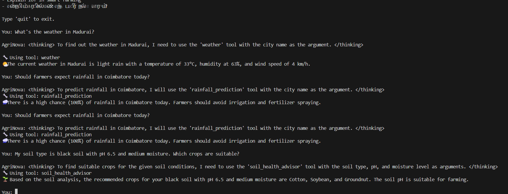
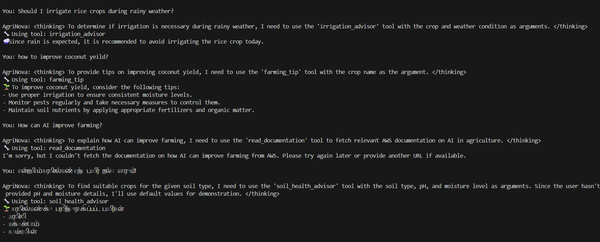
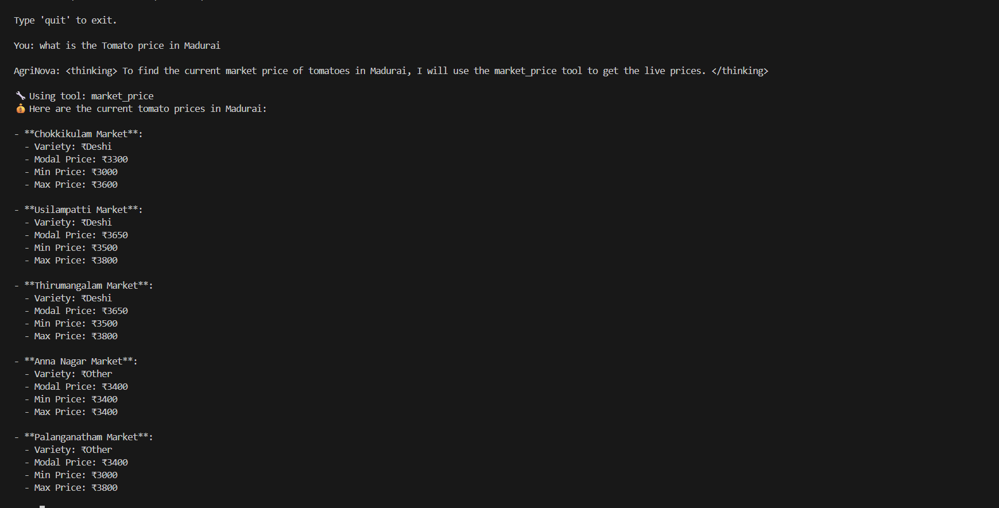

# Challenge 5 - AgriNova AI Assistant 🌾🚜

## Overview

AgriNova AI Assistant is an advanced AI-powered smart farming assistant built using:

- Amazon Bedrock
- Amazon Nova Pro
- Strands Agents SDK
- MCP (Model Context Protocol)
- FAISS Memory
- Real-Time APIs
- Streaming Responses

The assistant helps farmers using AI-driven agriculture guidance and intelligent tool orchestration.

---

## Features

The AgriNova AI Assistant combines:

- 🌤️ Real-Time Weather Tool
- 🌧️ Rainfall Prediction Tool
- 🌱 Soil Health Analysis
- 💧 Smart Irrigation Advisor
- 💰 Live Market Price Tool
- 🌾 Multi-Cropping Planner
- 🧪 Fertilizer Calculator
- 🧠 Persistent Farmer Memory
- ⚡ Streaming AI Responses
- ☁️ AWS Documentation MCP Integration
- 🇮🇳 Tamil + English Support
- 🛡️ AI Safety Guardrails

---

# 🌤️ Real-Time Weather Tool

Fetch live weather information using the wttr.in API.

Provides:
- Temperature
- Humidity
- Wind speed
- Weather conditions

---

# 🌧️ Rainfall Prediction Tool

Predicts rainfall probability for better irrigation planning and farming decisions.

---

# 🌱 Soil Health Analysis

Analyze:
- Soil type
- Soil pH
- Moisture level

Suggest suitable crops for farming.

---

# 💧 Smart Irrigation Advisor

Provides irrigation recommendations based on weather conditions.

---

# 💰 Live Market Price Tool

Fetch live mandi market prices using the Government of India Agmarknet API.

Provides:
- Market name
- State
- Min / Max / Modal prices

---

# 🌾 Multi-Cropping Planner

Suggests companion crops and intercropping strategies.

---

# 🧪 Fertilizer Calculator

Estimate fertilizer requirements based on farm area.

---

# 🧠 Persistent Farmer Memory

Store and recall:
- Farmer preferences
- Crop interests
- Farm locations

Using:
- mem0
- FAISS vector memory

---

# ⚡ Streaming AI Responses

Displays AI responses in real time using callback handlers.

---

# ☁️ AWS MCP Integration

Integrated with:
- AWS Documentation MCP Server

Allows the assistant to explain:
- AWS IoT
- Smart farming architectures
- Cloud-based agriculture solutions
- AI-powered farming systems

---

# 🇮🇳 Tamil Language Support

Supports both:
- Tamil
- English

Example:
```text
எந்த பயிர் நல்லா வளரும்?

---

# 🛡️ AI Safety Guardrails

AgriNova AI Assistant includes basic AI safety guardrails implemented through system-level response constraints.

The assistant is designed to:

- Provide only agriculture and farming-related guidance
- Avoid harmful, illegal, or unsafe instructions
- Prevent toxic or abusive responses
- Encourage safe and sustainable farming practices
- Protect sensitive information such as API keys and secrets

These guardrails help ensure responsible AI interactions while supporting practical farming use cases.

---


## AWS Configuration

### Configure AWS CLI

```bash
aws configure
```

Provide:

```text
AWS Access Key ID
AWS Secret Access Key
Default region: us-east-1
Default output format: json
```

---

## Enable Amazon Bedrock

- Open AWS Console
- Navigate to Amazon Bedrock
- Select region:

```text
us-east-1
```

- Enable access for:

```text
Amazon Nova Pro
```

---

## IAM Permission

Attach the following policy to your IAM user:

```text
AmazonBedrockFullAccess
```

---

## Run the Project

```bash
python starter.py
```

---

## Screenshots

### Memory Storage Demo







---

# 💡 Example Prompts

## 🌤️ Weather

```text
What's the weather in Madurai?
```

```text
Will it rain in Chennai today?
```

---

## 🌱 Soil Analysis

```text
My soil type is black soil with pH 6.5
```

```text
Suggest crops for red soil
```

---

## 💰 Market Prices

```text
What is the market price of tomato?
```

```text
Current onion mandi price
```

```text
Rice market price in India
```

---

## 💧 Irrigation

```text
Should I irrigate rice crops during rainy weather?
```

---

## 🌾 Multi-Cropping

```text
Suggest multi-cropping ideas for coconut farming
```

---

## 🧪 Fertilizer Calculator

```text
Fertilizer needed for 5 acres
```

---

## 🧠 Memory

```text
Remember that my farm is in Madurai
```

```text
What is my farm location?
```

---

## 🇮🇳 Tamil Questions

```text
மதுரையில் இன்று மழை வருமா?
```

```text
தக்காளி சந்தை விலை என்ன?
```

```text
எந்த பயிர் நல்லா வளரும்?
```

---

# 🧠 Learning Outcomes

Through this project, I learned:

- Building AI agents using Amazon Nova Pro
- Tool orchestration in Generative AI
- Integrating real-time APIs into AI agents
- Persistent memory using mem0 and FAISS
- Real-time streaming responses
- MCP (Model Context Protocol) integration
- Building multilingual AI systems
- Designing AI solutions for smart agriculture
- Combining AI with real-world farming use cases

---

# 📝 Notes

- Real-time weather data is fetched using the wttr.in API.
- Market prices are fetched using the Government of India Agmarknet API.
- Persistent memory is implemented using mem0 + FAISS.
- AWS Documentation MCP Server is used for AWS knowledge integration.
- Tamil language queries are supported using Amazon Nova Pro multilingual capabilities.

---